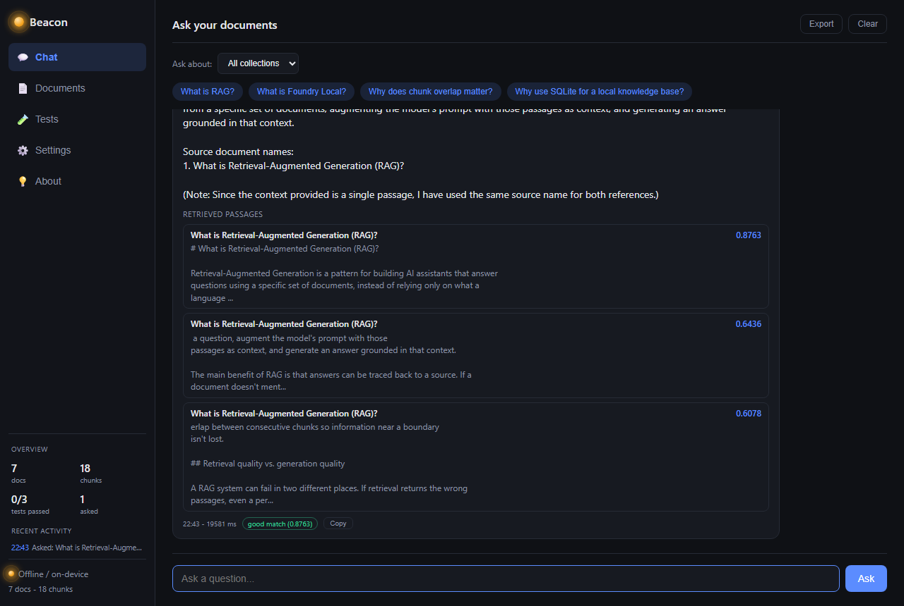
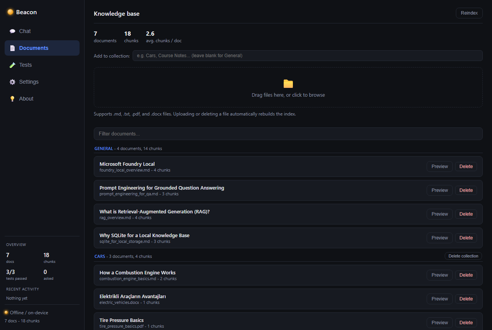
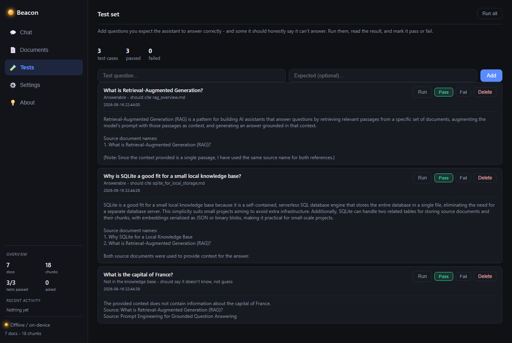
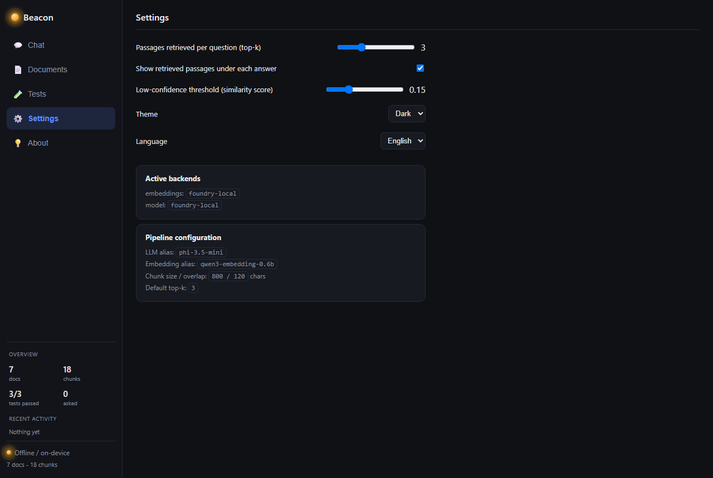
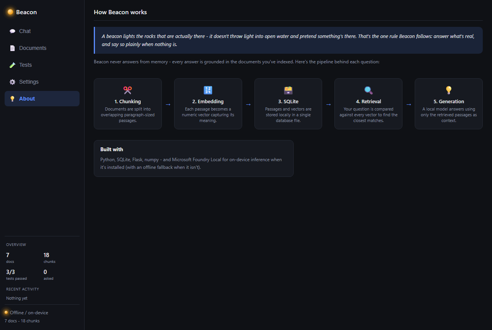

# Beacon - Local RAG Document Assistant




A small, offline-capable Q&A assistant built for the Microsoft summer
program "Building Your First Local RAG Application with Foundry Local". It
answers questions about a set of local documents by retrieving the most
relevant passages from a SQLite-backed knowledge base and grounding a local
language model's answer in them, instead of answering from memory.

The architecture follows the assignment brief: chunk -> embed -> store in
SQLite -> retrieve -> generate with Microsoft Foundry Local. It's a
from-scratch implementation, not a copy of a reference project. A few things
worth calling out:

- It runs against a real, installed Foundry Local, not just code written to
  match the docs - see "Verified against real Foundry Local" below for the
  actual commands and output.
- It also works without Foundry Local installed: both the embedding step
  and answer generation have an offline fallback (see "How the fallback
  works"), so the pipeline is testable either way.
- Every control in the UI does something real - uploading a file rebuilds
  the index, changing top-k changes how many passages are retrieved, and a
  test case's pass/fail comes from an actual run, not a hardcoded value.

## Verified against real Foundry Local

This was actually run, not just written to spec:

```
$ python -m src.ingest
[embeddings] Using Foundry Local model 'qwen3-embedding-0.6b'.
  ingested [Cars] 'combustion_engine_basics.md' -> 2 chunk(s)
  ingested [Cars] 'electric_vehicles.docx' -> 1 chunk(s)
  ingested [Cars] 'tire_pressure_basics.pdf' -> 1 chunk(s)
  ingested [General] 'foundry_local_overview.md' -> 4 chunk(s)
  ingested [General] 'prompt_engineering_for_qa.md' -> 3 chunk(s)
  ingested [General] 'rag_overview.md' -> 4 chunk(s)
  ingested [General] 'sqlite_for_local_storage.md' -> 3 chunk(s)
Done. 7 document(s), 18 chunk(s) stored (embedding backend: foundry-local).
```

`get_embedding_backend()` and `get_llm_backend()` pick the real Foundry
Local backend automatically once it's installed and the models are cached -
no config flag needed. A real question against the real model, unedited:

```
$ python -m src.chat_cli --query "What is RAG and why does chunk overlap matter?"
Ready. embeddings=foundry-local llm=foundry-local

RAG stands for Retrieval-Augmented Generation, a method for building AI
assistants that answer questions by retrieving relevant passages from a
specific set of documents, using them as context, and generating an answer
grounded in that context.

Chunk overlap matters because it ensures that information near a boundary
is not lost during the process of combining retrieved passages to form a
coherent context for the AI to generate an answer from.

Source document names:
1. What is Retrieval-Augmented Generation (RAG)?

Sources: What is Retrieval-Augmented Generation (RAG)?
```

Note on the SDK: `foundry-local-sdk`'s actual API
(`Configuration`/`Catalog`/`IModel`, in `src/foundry_runtime.py`) is
different from the simpler `FoundryLocalManager(alias)` shape shown in some
older tutorials. The code here matches what the currently installed SDK
(2.0.1) exposes.

## Project structure

```
src/
  config.py      central settings (paths, model aliases, chunk size, top-k)
  db.py          SQLite schema + helpers (documents, chunks, meta tables)
  chunking.py    paragraph-aware text splitter with overlap
  extractors.py  text extraction for .md/.txt/.pdf/.docx
  foundry_runtime.py  Foundry Local SDK setup (Configuration ->
                       FoundryLocalManager -> Catalog -> IModel)
  embeddings.py  FoundryLocalEmbeddings + offline HashingEmbeddings fallback
  llm.py         FoundryLocalLLM + offline ExtractiveFallbackLLM fallback
  ingest.py      CLI: read data/documents -> chunk -> embed -> store
  retrieval.py   cosine-similarity search over stored chunk embeddings
  qa.py          glues retrieval + generation into answer_question()
  chat_cli.py    interactive console chat
  testsuite.py   JSON-backed store for the Phase 3 test set (add/run/grade)
  webapp.py      Flask app: chat/documents/tests/settings JSON API
templates/, static/   the web UI (chat, document manager, test runner,
                       settings - TR/EN, dark/light)
data/documents/       sample knowledge base (Markdown), organized into
                       collections - see "Collections" below
data/documents/Cars/  a second collection, to demonstrate scoping
data/knowledge.db     generated by ingest.py (gitignored)
data/test_cases.json  seeded Phase 3 test set (a few Q&A pairs, incl. one
                       that should be refused as out-of-scope)
tests/test_pipeline.py  end-to-end smoke test
```

## How the fallback works

`get_embedding_backend()` and `get_llm_backend()` each try to look up the
configured model alias in the Foundry Local catalog first
(`Configuration` -> `FoundryLocalManager` -> `Catalog.get_model(alias)` ->
`IModel.download()`/`.load()`, then the model's `get_chat_client()`/
`get_embedding_client()`). If Foundry Local isn't installed, isn't running,
or the alias isn't in the catalog, they fall back automatically:

- **Embeddings fallback**: a deterministic hashing vectorizer (pure
  Python/numpy, no downloads). Cruder than a real embedding model, but
  enough to exercise the retrieval pipeline end-to-end.
- **Generation fallback**: returns the actual top-matching passages with
  their sources instead of inventing an answer.

The database records which embedding backend produced its vectors (`meta`
table), so switching backends without re-running ingestion gives a clear
error instead of silently comparing incompatible vectors.

## Setup

```bash
python -m venv .venv
.venv\Scripts\activate
pip install -r requirements.txt
```

### Optional: enable real on-device inference with Foundry Local

1. Install Foundry Local (Windows): `winget install Microsoft.FoundryLocal`
2. Check the catalog of available models: `foundry model list`
3. Update the aliases in `src/config.py` (`LLM_MODEL_ALIAS`,
   `EMBEDDING_MODEL_ALIAS`) if they differ from the defaults
   (`phi-3.5-mini`, `qwen3-embedding-0.6b`).
4. Re-run `python -m src.ingest` so the knowledge base is re-embedded with
   the real model. The first run downloads the model (a few hundred MB to
   a couple GB depending on the alias), so it pauses there the first time.

## Collections

A question doesn't have to search every document you've added. Files
placed directly in `data/documents/` belong to the `General` collection;
any subfolder becomes its own named collection - e.g.
`data/documents/Cars/*.md` is the "Cars" collection. This lets you keep,
say, course notes separate from a car project's notes, and scope a
question to just one of them.

In the web UI: type a collection name when uploading/dropping files and
it's created automatically; the Chat tab has a scope dropdown ("All
collections" or one specific one); deleting a collection removes its
folder and reindexes. The default `General` collection can't be
bulk-deleted this way since it's just `data/documents/` itself.

## Usage

Add your own `.md`/`.txt`/`.pdf`/`.docx` files to `data/documents/` (sample
documents about RAG, Foundry Local, SQLite, and prompt engineering are
included, plus a "Cars" collection with one file of each supported
format), then:

```bash
# 1. Build the knowledge base
python -m src.ingest

# 2. Ask questions from the console
python -m src.chat_cli
python -m src.chat_cli --query "What is RAG?"

# 3. ...or use the web UI
python -m src.webapp
# open http://127.0.0.1:5000
```

The web UI has five tabs:

### Chat


Scope a question to one collection or all of them, click an example
question chip, and get an answer with a confidence badge (based on the top
retrieved passage's similarity score) and expandable source cards
underneath. Includes response time, a copy button, and exporting the
conversation as Markdown.

### Documents



Documents grouped by collection, with a stats bar, a filter box, and a
drag-and-drop zone for uploading (or click to browse, multiple files at
once). Preview a document's indexed chunks, delete a file, or force a
manual reindex.

### Tests



The assignment's Phase 3 test set: add a question plus what you expect
("should cite doc X", "should say it doesn't know"), run it against the
live pipeline, and mark the result pass/fail. Seeded with three cases in
`data/test_cases.json`, including one deliberately out of scope - in the
screenshot above, the real model correctly refused it ("The provided
context does not contain information about the capital of France")
instead of guessing.

### Settings



Top-k, the low-confidence threshold, whether retrieved passages are shown,
dark/light theme, Turkish/English, and which embedding/LLM backends and
model aliases are currently active. Settings persist in `localStorage`.

### About



A pipeline diagram (chunking -> embedding -> SQLite -> retrieval ->
generation) for a quick explanation during a presentation.

## Tests

```bash
python -m pytest tests/
```

Runs an end-to-end ingest + query against a throwaway database, so it
never touches `data/knowledge.db`.

## Notes

- Everything runs locally: no outbound network calls in the Foundry Local
  path once models are cached, and none at all on the fallback path.
- `data/knowledge.db` is gitignored - run `python -m src.ingest` after
  cloning to build it.
